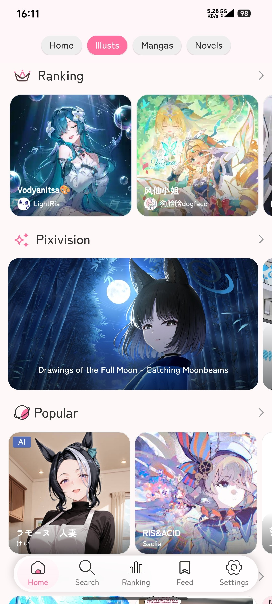
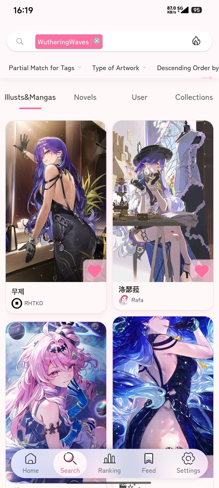

<h1 align="center">Pixiv Viewer <small>Kai</small></h1>

又一个 Pixiv 插画与小说阅览工具。

简体中文 | [English](../README.md)

又一个 Pixiv 阅览工具，提供 Pixiv 插画、动图、漫画和小说等作品的在线浏览。适配多端（Android / iOS / Windows / macOS / Linux），提供多种浏览布局选择，支持自定义 API 与图床，支持 RefreshToken / OAuth / Cookie 方式登录。

**在线预览：** 🔗 [pixiv.pictures](https://pixiv.pictures)

**下载：** ⏬ [GitHub Releases](https://github.com/asadahimeka/pixiv-viewer-app/releases)

---

## 📖 文档

| 文档 | 说明 |
| --- | --- |
| [功能特性](./Features.zh-CN.md) | 完整的功能列表与说明 |
| [架构与技术细节](./Architecture.zh-CN.md) | 技术栈、项目结构与实现细节 |
| [开发指南](./Development.zh-CN.md) | 环境搭建、常用脚本与代码规范 |
| [部署说明](./Deployment.zh-CN.md) | 自建 Web 部署与各平台客户端打包 |
| [常见问题](./FAQ.zh-CN.md) | 使用与安装常见问题 |

---

## 📥 下载

> 请到 [GitHub Releases](https://github.com/asadahimeka/pixiv-viewer-app/releases) 获取最新版本。

| 平台 | 格式 |
| --- | --- |
| Android | [APK (Universal)](https://github.com/asadahimeka/pixiv-viewer-app/releases/download/v1.37.5/pixiv-viewer_1.37.5_android.apk) |
| iOS | [IPA (未签名，需自行签名单侧载)](https://github.com/asadahimeka/pixiv-viewer-app/releases/download/v1.37.5/pixiv-viewer_1.37.5_ios_unsigned.ipa) |
| Windows | [EXE 安装包](https://github.com/asadahimeka/pixiv-viewer-app/releases/download/v1.37.5/Pixiv-Viewer_1.37.5_x64-setup.exe) / [MSI 安装包](https://github.com/asadahimeka/pixiv-viewer-app/releases/download/v1.37.5/Pixiv-Viewer_1.37.5_x64_en-US.msi) |
| macOS | [DMG (Apple Silicon)](https://github.com/asadahimeka/pixiv-viewer-app/releases/download/v1.37.5/Pixiv-Viewer_1.37.5_aarch64.dmg) / [DMG (Intel)](https://github.com/asadahimeka/pixiv-viewer-app/releases/download/v1.37.5/Pixiv-Viewer_1.37.5_x64.dmg) |
| Linux | [deb](https://github.com/asadahimeka/pixiv-viewer-app/releases/download/v1.37.5/Pixiv-Viewer_1.37.5_amd64.deb) / [rpm](https://github.com/asadahimeka/pixiv-viewer-app/releases/download/v1.37.5/Pixiv-Viewer-1.37.5-1.x86_64.rpm) / [AppImage](https://github.com/asadahimeka/pixiv-viewer-app/releases/download/v1.37.5/Pixiv-Viewer_1.37.5_amd64.AppImage) / [Arch pkg](https://github.com/asadahimeka/pixiv-viewer-app/releases/download/v1.37.5/pixiv-viewer-1.37.5-1-x86_64.pkg.tar.zst) |

## ✨ 功能特性

详见 [功能特性](./Features.zh-CN.md)。

## 📱 预览

<kbd></kbd>  <kbd></kbd>

<kbd></kbd>  <kbd></kbd>

## 💖 赞助支持

如果这个项目对你有帮助，欢迎请我[喝杯咖啡](https://sponsors-yumine.netlify.app)：

赞助列表: https://sponsors-yumine.netlify.app/account

## ❓ 常见问题

详见 [常见问题](./FAQ.zh-CN.md)。

## 🤝 反馈

提交 Issue 请到：https://github.com/asadahimeka/pixiv-viewer/issues

## 🏆 致谢

### 特别感谢

- [journey-ad/pixiv-viewer](https://github.com/journey-ad/pixiv-viewer)：原项目，修改于此

### 贡献者

- [@Blueberryy](https://github.com/Blueberryy)：俄语翻译
- [@olivertzeng](https://github.com/olivertzeng)：繁体中文翻译

### 相关项目

- [HibiAPI](https://github.com/mixmoe/HibiAPI)：提供大部分接口支持
- [PixivNow](https://github.com/FreeNowOrg/PixivNow)：提供部分网页版接口支持
- [PixEz](https://github.com/Notsfsssf/pixez-flutter)：直连模式与客户端逻辑参考
- [Pixiv-Shaft](https://github.com/CeuiLiSA/Pixiv-Shaft)：直连模式逻辑参考
- [pxder](https://github.com/Tsuk1ko/pxder)：OAuth 登录参考实现
- [IllustFerry](https://github.com/peasoft/IllustFerry)：应用内登录参考
- [ShinobuTranslator](https://github.com/DonutShinobu/ShinobuTranslator)：漫画翻译引擎
- [KISS Translator](https://github.com/fishjar/kiss-translator)：整页翻译工具

### 服务

- [Pixiv.cat](https://pixiv.re/)：图像反代服务
- [SauceNAO](https://saucenao.com/)：以图搜图功能接口

### 技术栈

- [Vue](https://vuejs.org/)：前端框架
- [Vant UI](https://vant-ui.github.io/vant/v2/#/zh-CN/)：UI 组件库
- [Vue I18n](https://kazupon.github.io/vue-i18n/)：国际化支持
- [Capacitor](https://capacitorjs.com/)：跨平台原生容器
- [Tauri](https://tauri.app/)：桌面端容器

## 📜 免责声明

本项目与 pixiv.net（ピクシブ株式会社）无任何隶属关系。

本项目网站、APP 所展示的所有作品的版权均为 Pixiv 或其原作者所有。

本项目仅供交流与学习，不得用于任何商业用途。

## 📄 许可证

**如果这个项目对你有帮助，请给一个 ⭐️ Star 支持一下！**

Made with ❤️ by Sakura Yumine
